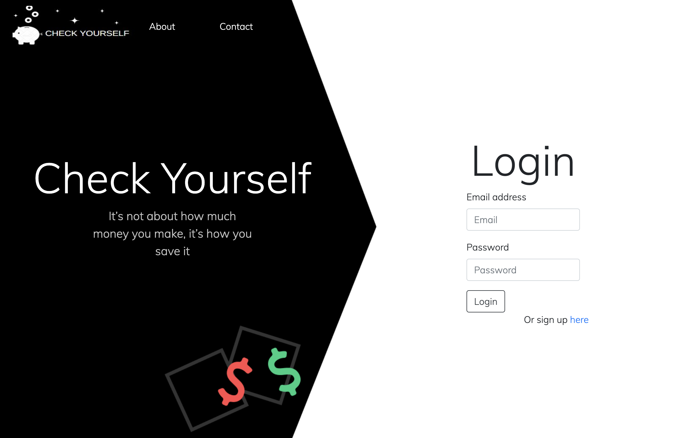
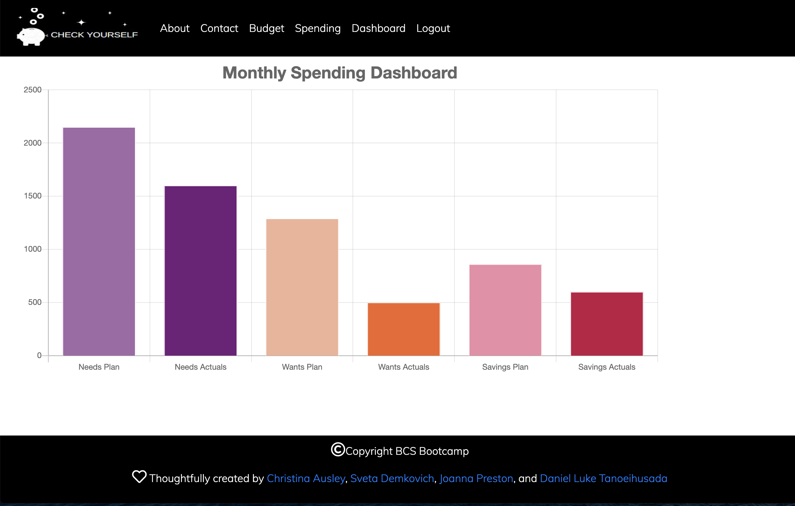
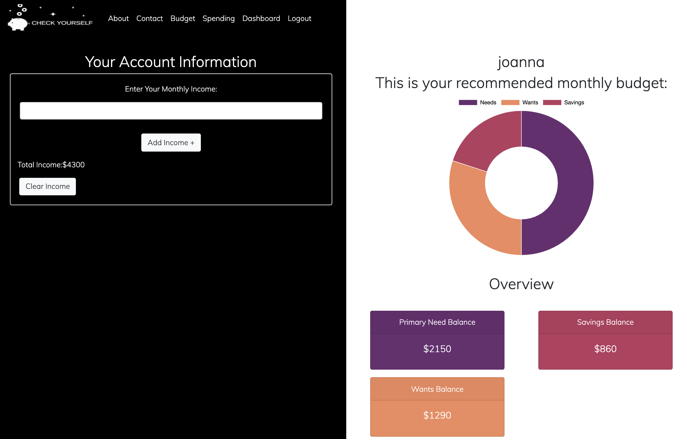
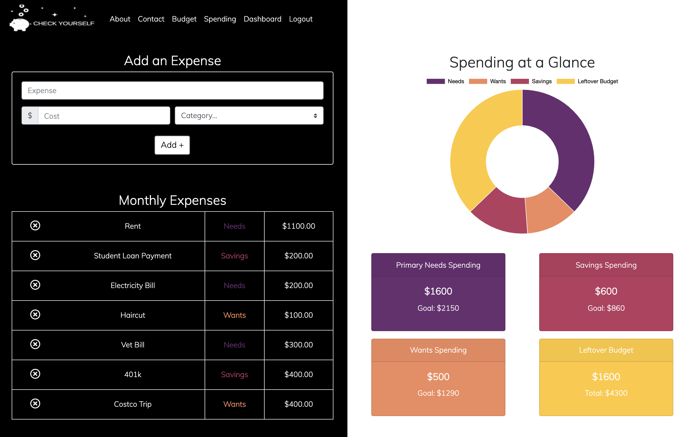
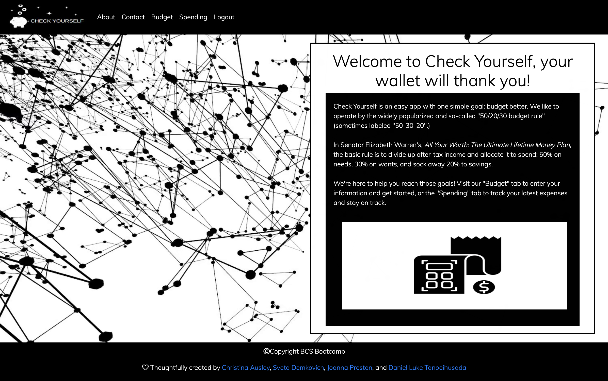
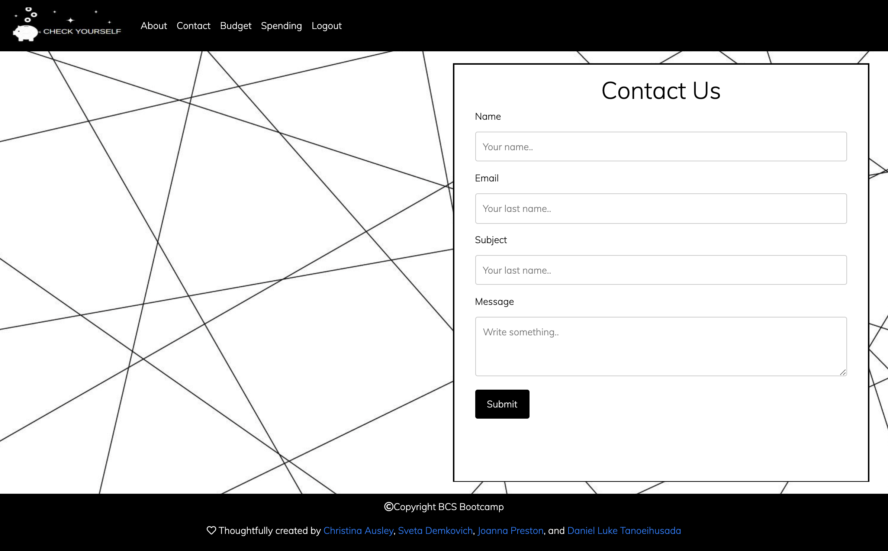

# [Check Yourself](https://jp-project2.herokuapp.com/)

## Description
Not sure where your money seems to disappear to every month? Hoping to be smarter with your income, and keep your spending in check? Then look no further than Check Yourself!

Check Yourself is a full-stack budgeting application, that helps the user track their monthly expenses and manage their money wisely. When a user enters their monthly income, they are presented with a suggested breakdown of how they should be spending their money, based on the [50/30/20](https://www.thebalance.com/the-50-30-20-rule-of-thumb-453922) rule. This rule suggests that 50% of your monthly income should go towards your needs, 30% towards your wants, and 20% towards your savings.

After the user has entered their monthly income they are able to enter their monthly expenses, and must classify an expense in one of the three categories: wants, needs, or savings. They can then view a chart displaying the percentage breakdown of their expenses in these categories, and compare their actual spending to their suggested spending in these categories. This forces the user to really exam where their money is going every month, and identify areas where they can improve. Ultimately resulting in a wiser spender!

Check Yourself is built with Node and Express. It uses Passport.js for user authentication, and stores the users information in a MySQL Database. It was built by an awesome group of developers, listed in the [credits](#credits) section.

 

 

 

## Table of Contents
* [Technologies](#technologies)
* [Usage](#usage)
* [Finished Product](#finished-product)
* [Credits](#Credits)
* [Questions](#questions)

## Technologies
* HTML
* CSS
* Bootstrap
* Handlebars
* JavaScript
* Node.js
* Express.js
* Passport.js
* [Chart.js](https://www.chartjs.org/)
* [Animate.css](https://animate.style/)
* MySQL
* Sequelize
* ESLint
* Travis CLI

## Usage
* Navigate to the [deployed Heroku App](https://jp-project2.herokuapp.com/).
* Login or click "Sign Up" to Create an Account.
* Once logged in, enter your monthly income on the Home Page.
    * View a chart that splits up your suggested spending in the three categories: Needs, Wants, and Savings (based on the 50/30/20 rule).
* Navigate to the Spending page to add your monthly expenses.
    * Choose a category your expense falls under (Needs, Wants, or Savings).
    * View a table of your monthly expenses.
    * Add or delete an expense from this table at any time.
    * View a chart that splits up your expenses in the three categories: Needs, Wants, and Savings.
    * View your spending in a category compared to your goal spending in that category.
* Navigate to the Dashboard page to view a bar chart of your suggested breakdown of expenses, compared to your actual break down of expenses, in order to track your budgeting progress.

## Finished Product
View deployed Heroku app [here](https://jp-project2.herokuapp.com/).  
View a video of the full application [here](https://drive.google.com/file/d/1XqTCC55GbH0I114fKOVrqhTVmMhPOKVF/view). 

## Credits
* [Joanna Preston](https://github.com/jpreston-alt)
    * Back-end developer.
    * Connecting front-end to back-end.
* [Christina Ausley](https://github.com/cmausley)
    * Front-end developer & designer.
    * Creating stylistic harmony throughout application.
* [Daniel Luke Tanoeihusada](https://github.com/gidmp)
    * Front-end developer & UI Designer.
    * Styling and mobile responsiveness.
* [Svetlana Demkovich](https://github.com/sdemkovich)
    * Front-end developer.
    * Connecting front-end to back-end.

## Questions
If you have any questions about the repo, please contact me, Christina, Daniel, or Svetlana via the GitHub links above.